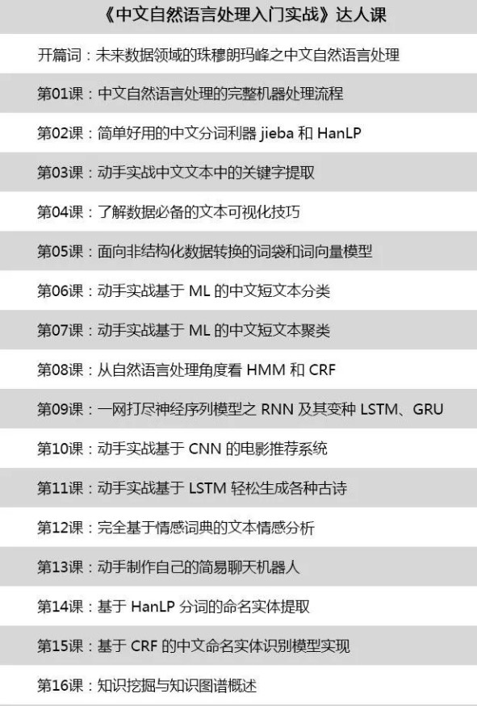

# 目录

- [目录](#%E7%9B%AE%E5%BD%95)
  - [AI算法](#ai%E7%AE%97%E6%B3%95)
    - [List](#list)
      - [好文](#%E5%A5%BD%E6%96%87)
      - [book](#book)
      - [公司](#%E5%85%AC%E5%8F%B8)
      - [教程](#%E6%95%99%E7%A8%8B)
      - [吴恩达](#%E5%90%B4%E6%81%A9%E8%BE%BE)
    - [NLP](#nlp)
      - [业界](#%E4%B8%9A%E7%95%8C)
      - [公司](#%E5%85%AC%E5%8F%B8-1)
      - [Book](#book)
      - [演讲](#%E6%BC%94%E8%AE%B2)
      - [教程](#%E6%95%99%E7%A8%8B-1)
      - [Github](#github)
      - [Lib库](#lib%E5%BA%93)
      - [知识图谱](#%E7%9F%A5%E8%AF%86%E5%9B%BE%E8%B0%B1)
      - [医学影像数据集](#%E5%8C%BB%E5%AD%A6%E5%BD%B1%E5%83%8F%E6%95%B0%E6%8D%AE%E9%9B%86)


==========================================================

## AI算法

### List

//
> ----------AI前线
> https://mp.weixin.qq.com/s?__biz=MzU1NDA4NjU2MA==&mid=2247495100&idx=2&sn=385612fdf8a24586077c9077d2252d29&chksm=fbea5473cc9ddd6560d0edb8e5a63c0fe012928b696d80911d5e3c76924cfce1fdc481304633&mpshare=1&scene=1&srcid=#rd
NLP新尝试：如何让机器读懂并预测人类的喜怒哀乐？


。。https://github.com/hankcs/HanLP Star 6273
HanLP是由一系列模型与算法组成的Java工具包，目标是普及自然语言处理在生产环境中的应用。HanLP具备功能完善、性能高效、架构清晰、语料时新、可自定义的特点。在提供丰富功能的同时，HanLP内部模块坚持低耦合、模型坚持惰性加载、服务坚持静态提供、词典坚持明文发布，使用非常方便，同时自带一些语料处理工具，帮助用户训练自己的模型。

#### 好文

//
> ----------樱园的玻尔兹曼机
> https://mp.weixin.qq.com/s?__biz=MzI5NzAzODcyNw==&mid=2454898178&idx=1&sn=09e12b372561d952dd9735b851c0412b&chksm=fb1d40eacc6ac9fc8b4d3515fb71884baa238baea5357e1436f4a46eb68ae216d65fa82a8219&mpshare=1&scene=1&srcid=0130TRbsV5tWqzMpGxyIX1Np#rd
2018年，我的故事


//
> ----------Versa 创始人蔡天懿：人工智能是一种思维方式_互金知识_网贷之家
> https://m.wdzj.com/hjzs/ptsj/20180225/569267-1.html?from=singlemessage
```
其次，AI 是一门技术，但是绝不高深；AI 只是一个应用级的科学；AI 除了是一门技术，更是一种思维方式，要让 AI 思维武装到每一个员工身上。

你不需要了解它是什么 AI 的算法，给大家简单举一个例子，这也是 Versa 的日常。Versa 有一位姑娘叫****，她给 Versa 做的工作就是负责 KOL 在微博上的投放。她面临一个问题，微博上的KOL假粉有点多，投放的时候老踩雷。在此之前她主要运用她的经验去判断，去看粉丝的属性看这个 KOL 是真粉多还是假粉多，来判断KOL该不该投，更多靠的是方法、经验。

当她来到 Versa 的时候，希望能用一个模型来解决。第一步判断问题，该投不该投，这是一个典型的分类问题。所有的问题在 AI 面前只有 7 种，关于一个 KOL 该不该投属于分类问题。她收集了 2000 个数据，收集 KOL 微博所有的评论、点赞数、评论数，然后做了一个操作，根据数据结果是零还是一，来判断这个 KOL 该不该投，就结束了。

剩下来的就特别简单了。在 Versa 里面有一个 APP，里面针对分类问题里有许多现有的 APP 和模型，但这三个是比较有效的，其实大家根本不用明白这三个是什么东西，为什么？因为我们只要拿着我们的数据，我们跑这些模型就可以了。有一个模型的准确率达到了 96%，这就是我们的 AI 模型。在 Versa 的小伙伴简简单单的训练了一个 AI 的模型，而在整个过程他没有了解 AI 的算法，然后效果怎么样呢？快太多，并且挺好的。

对于 **** 来说，她现在可以把这个模型给我们所有部门的小伙伴，她之前想把自己的经验分享给我们，但她很难用语言去总结，现在她只需要通过 AI 模型就可以了，新来的小伙伴也可以通过 AI 模型来判断这个 KOL 该不该投。

这样的例子在 Versa 比比皆是：我们有一个 APP，里面有许多的模型，有一些模型是 Versa 自主研发的，有一些模型就是非常经典的神经网络模型；无论是从 KOL 的投放到架构师去动态加 GPU 的机器，还是到社区里面去处理拉新评论，这些模型都能解决。Versa 的员工，即使没有专业 AI 的背景，也会使用 AI 工具解决他们的问题。

Versa是一个用 AI 思维武装到每个员工的公司，这是我认为小公司可以在这个时代赢的重要原因之二。
```

#### book

//
> ----------Versa 创始人蔡天懿：人工智能是一种思维方式_互金知识_网贷之家
> https://m.wdzj.com/hjzs/ptsj/20180225/569267-1.html?from=singlemessage
周志华老师在《机器学习》一书中也简明扼要的总结：“NFL定理最重要的寓意，是让我们清楚的认识到，脱离具体问题，空泛的谈‘什么学习算法更好’毫无意义。”


#### 公司

//
> ----------Versa 创始人蔡天懿：人工智能是一种思维方式_互金知识_网贷之家
> https://m.wdzj.com/hjzs/ptsj/20180225/569267-1.html?from=singlemessage
其次，AI 是一门技术，但是绝不高深；AI 只是一个应用级的科学；AI 除了是一门技术，更是一种思维方式，要让 AI 思维武装到每一个员工身上。


//
> ----------达观数据
> https://mp.weixin.qq.com/s?__biz=MzA5NzY0MDg1NA==&mid=2706956016&idx=1&sn=fd101c9eabd357df5ea872ef2a503ec9&chksm=b431b60983463f1f03f912618be57d746683c819356a06e145217871623bc229f84f8539fefa&mpshare=1&scene=1&srcid=1011NDuubCj2qgZDyctvbzF4#rd
达观数据：上海唯一入选“吴文俊人工智能企业技术创新工程项目奖”的 AI 企业


#### 教程

//
> ----------开源最前线
> https://mp.weixin.qq.com/s?__biz=MzA3NzA2MDMyNA==&mid=2650349232&idx=1&sn=156271ceca9724729e81697650d236c9&chksm=875a7f3bb02df62df245a573829a00a287a35e5371f89b85353e32aa5f61b586220c20727027&mpshare=1&scene=1&srcid=0202kgehQ6H7cBwdCVAVZzAX#rd
为了帮助正在学习深度学习的伙伴们，川大的一名优秀毕业生，在GitHub上创建了一个项目：《深度学习500问》，通过问答的形式对常用的概率知识、线性代数、机器学习、深度学习、计算机视觉等热点问题进行阐述，以帮助自己及有需要的读者。 全书分为15个章节，近20万字。


//
> ----------开源最前线
> https://mp.weixin.qq.com/s?__biz=MzA3NzA2MDMyNA==&mid=2650348686&idx=1&sn=48d84db57e6abefb3a7795230be3d1ea&chksm=875a7d05b02df4133c463ddf5293a66e3df5663e602c26acb5d7194d76399bc2c9aef99b1ff4&mpshare=1&scene=1&srcid=0202iw8eQmlGQKWObHIuOpJz#rd
最重要的是，该行业在过去几年中经历了巨大的变革。以前，要成为一名机器学习专家，你需要有一个博士学位（或一些高学历），但现在已经不是这样了。由于大型科技公司如Alphabet（谷歌母公司），IBM，微软等公司的参与，现在任何人都可以更轻松地开始机器学习。


这不，YouTube上的大咖Siraj Raval就发起了一个挑战赛：#100DaysOfMLCode。


//
> ----------量子位
> https://mp.weixin.qq.com/s?__biz=MzIzNjc1NzUzMw==&mid=2247509988&idx=3&sn=161a2a01774f1aa1673a3b6a63555991&chksm=e8d01096dfa799802507d550f99228289bb1ac3474f813a7181b1562a60491ab5377881f5698&mpshare=1&scene=1&srcid=0130akkiyyNxuWocigM1YFXI#rd
GitHub标星2600，从零开始的深度学习实用教程 | PyTorch官方推荐
项目出自一位印度少年之手，基于PyTorch。少年为向往机器学习的小伙伴们，指引了一条从萌新到老司机的进阶之路。

新手可以从基础的基础开始学起，不止线性规划和随机森林，连笔记本怎么用，NumPy等重要的Python库怎么用，都有手把手教程。


#### 吴恩达

//
> ----------大数据文摘
> https://mp.weixin.qq.com/s?__biz=MjM5MTQzNzU2NA==&mid=2651659326&idx=2&sn=3400e9b8c7bbf091ded21aa2392afa5f&chksm=bd4c3bad8a3bb2bb0ae421e6467fab121d50a9d3ef737913ecc17b16f90aa73dcca914afe750&mpshare=1&scene=1&srcid=0201xh0xeQGHavhVNNi0ciiY#rd
吴恩达刚刚注册了一个微信公众号，发布新书与课程中文版

人工智能内容领域的大IP吴恩达老师今天刚刚建立了自己的首个官方微信公众号吴恩达deeplearningai，专注产生和传播人工智能的原创内容。

//
> ----------机器之心
> https://mp.weixin.qq.com/s?__biz=MzA3MzI4MjgzMw==&mid=2650738808&idx=1&sn=950b3a51af28a0434018343a2810bc82&chksm=871ad406b06d5d1000a246ea73acb9bec34e9b1de8f19fc90e473f071a2c40667676a174eb1b&mpshare=1&scene=1&srcid=0201qRABX3a70AFLqpOCG68U#rd
这是一份优美的信息图，吴恩达点赞的deeplearning.ai课程总结


<br>[⬆ 回到顶部](#目录)

===============================================

### NLP

#### 业界


//
> ----------为什么说 NLP 将是未来数据领域的珠峰？::GitChat精品课
> https://mp.weixin.qq.com/s?__biz=MzA4Mzc0NjkwNA==&mid=2650787324&idx=2&sn=5e0570f0c9b4ce54d26b29b8019dde4c&chksm=87faa4cbb08d2dddf7de45e50cdc7b0954fbdad3310bde81862fc4633123e3f6d0809a6a5dfe&mpshare=1&scene=1&srcid=02022iLkJ9yqVJASdOSeHBz7#rd
为什么说未来数据领域的珠穆朗玛峰是中文自然语言处理？
正是基于上面对中国互联网发展的总结，对当前数据领域所面临的挑战以及资本市场对人工智能的认可分析，未来数据领域的重点是自然语言处理技术及其在智能问答、情感分析、语义理解、知识图谱等应用方面的突破。


//
> ----------深度长文：中文分词的十年回顾
> https://www.toutiao.com/a6652096166550831627/?tt_from=android_share&utm_campaign=client_share&timestamp=1549021698&app=news_article&iid=59835956289&utm_medium=toutiao_android&group_id=6652096166550831627


#### 公司

//
> ----------【助理来也_助理来也招聘】北京来也网络科技有限公司招聘信息-拉勾网
> https://www.lagou.com/gongsi/93760.html
「来也」是国内领先的人工智能交互平台，由常春藤盟校（Ivy League）归国博士和MBA团队发起，核心技术涵盖自然语言处理（NLP）、多轮对话控制和个性化推荐系统等。


//
> ----------【小i机器人_小i机器人招聘】上海智臻智能网络科技股份有限公司招聘信息-拉勾网
> https://www.lagou.com/gongsi/48693.html
领先的AI技术和产业化平台，赋能多产业升级。

小i机器人是领先的人工智能技术和产业化平台供应商，提供包括自然语言处理、深度语义交互、语音识别、图像识别、机器学习和大数据技术等在内的人工智能核心技术及将技术与通信、金融、政务、法务、医疗、制造等行业深度结合的解决方案和服务体系，为千家大中型客户、数十万开发者及中小企业提供服务，全球用户超过8亿，实现AI的大规模商用落地。

//
> ----------【竹间智能科技(上海)有限公司_竹间智能科技(上海)有限公司招聘】竹间智能科技（上海）有限公司招聘信息-拉勾网
> https://www.lagou.com/gongsi/98800.html
致力于打造中国首款情感机器人


//
> ----------首页 - BosonNLP
> https://bosonnlp.com/

//
> ----------BosonNLP分词技术解密 - NLP - SegmentFault 思否
> https://segmentfault.com/a/1190000003891573
在九月初BosonNLP全面开放了分词和词性标注引擎以后，很多尤其是从事数据处理和自然语言研究的朋友在试用后很好奇，玻森如何能够做到目前的高准确率？希望这篇文章能够帮助大家理解玻森分词背后的实现原理。

众所周知，中文并不像英文那样词与词之间用空格隔开，因此，在一般情况下，中文分词与词性标注往往是中文自然语言处理的第一步。一个好的分词系统是有效进行中文相关数据分析和产品开发的重要保证。

玻森采用的结构化预测模型是传统线性条件随机场（Linear-chain CRF）的一个变种。在过去及几年的分词研究中，虽然以字符为单位进行编码，从而预测分词与词性标注的文献占到了主流。这类模型虽然实现较容易，但比较难捕捉到高阶预测变量之间的关系。比如传统进行词性标注问题上使用Tri-gram特征能够得到较高准确率的结果，但一阶甚至高阶的字符CRF都难以建立这样的关联。所以玻森在字符编码以外加入了词语的信息，使这种高阶作用同样能被捕捉。


//
> ----------BosonNLP 分词与词性标注 API 新版上线，全面免费开放 - V2EX
> https://www.v2ex.com/t/217316
为开发者提供高质量的分析引擎，这是我们 BosonNLP 语义开发平台成立的初衷。自然语言处理（ NLP ）是一个专业领域，玻森已经有多年的积累。我们希望自己在 NLP 上花费足够多的时间，从而作为开发者的您不需要在上面花费太多时间。希望您能更多集中在产品和创意，或得闲出门走走，看看这个挺大的世界。

本次分词与词性标注引擎是 BosonNLP 过去一年最大的升级：

我们将服务器从美国迁回了中国，调用速度有成倍的提升
通过不断对算法进行调优，我们成功将分词与词性标注的错误率降低了 25%~35%
我们决定将其不加限制，完全免费开放出来
features:

RESP API 模式， SDK 与之前调用接口完全兼容
提供不同的分词粒度选项
提供繁简转换与特殊字符处理


//
> ----------虎博招聘
> https://mp.weixin.qq.com/s?__biz=MzU3MTc0MTkyNA==&mid=2247483706&idx=1&sn=e261437eb79b899f43aaca899819e471&chksm=fcdac2b1cbad4ba7ef08069cfc0988acac5433934fe5a41a0c1251387bfb81aa89f31fa5210a&mpshare=1&scene=1&srcid=0129A6U1HGB5pOuD0nGWBqA8#rd
虎博科技选择了最难的一条路——深入自然语言处理，改变人们获取信息的方式。


//
> ----------对话优图实验室郑冶枫：从西门子到腾讯，医疗 AI 如何突围？--AI掘金志
> https://mp.weixin.qq.com/s?__biz=MzIxMzY0OTQyNQ==&mid=2247487203&idx=1&sn=526d5601c2aa4bc1c97d6e5b868e9ec2&chksm=97b2df9da0c5568b6bfaec74d9a8fdae2973ae5bec42c63fd309c5c6ef88161aa8d3bf1c8dcb&mpshare=1&scene=1&srcid=01148wmGJ7mKAwzQj2cx5BzI#rd
过去两年，医疗影像AI领域掀起了一股人才回流潮。

这有些出人意料，但又在情理之中。一方面，中国庞大人口基数创造出的丰富医疗数据资源，为医疗AI提供了充足的养料供给；另一方面，稀缺的医疗资源则为医疗AI扎稳根基创造了得天独厚的条件。这些条件，更易于他们全面释放在海外的积淀。

2017年11月15日，“首批国家新一代人工智能开放创新平台名单”正式公布，**腾讯**成为“医疗影像国家新一代人工智能开放创新平台”的担纲者。这彻底打消了郑冶枫的顾虑，他确信腾讯将在医疗AI领域持续投入。

2018年上半年，两支团队不断穿梭往返于北上广的顶级三甲医院，和医生沟通交流，了解医生的需求，并结合技术可行性确定产品方向。
人类疾病多如星辰，而优图实验室的**医疗AI团队**规模有限，产品方向上必然要做一些取舍。郑冶枫介绍，团队选择项目时主要有两个维度的考量：一是需求的迫切程度，主要看疾病的发病率和死亡率，两项数值越高说明技术带来的社会价值越大；二是技术的复杂程度，比如有些疾病对AI技术需求非常迫切，但囿于筛查手段的缺乏，项目也无法展开。

“腾讯觅影”正式发布以来，一共上线了6个病种的辅助诊断产品，其中有3个是优图实验室的医疗AI团队主导开发的，包括包括肺结节、眼科疾病和宫颈癌筛查。

医疗影像AI发展到今天，赛道已经非常拥挤。据不完全统计，**国内涉足医疗影像AI的企业已经超过了100家**，而且研究方向比较重叠，主要集中在肺结节、眼部疾病等少数几个病种。

//
> ----------深度学习自然语言处理
> https://mp.weixin.qq.com/s?__biz=MzI3ODgwODA2MA==&mid=2247486201&idx=2&sn=bfb9ba40ad0c5b5ff6ade0a88e178b63&chksm=eb501e6adc27977c0b35ce4c727dcf1b0ffc7f3f1b4b318ec5c8535188cad4d84f2b1ad1bf76&mpshare=1&scene=1&srcid=01215F9CyqRU4wbHrAp6ffuH#rd
**微软**开发的 NLP 技术琳琅满目，包括输入法、分词、句法/语义分析、文摘、情感分析、问答、跨语言检索、机器翻译、知识图谱、聊天机器人、用户画像和推荐等，已经广泛应用于 Windows、Office、Bing、微软认知服务、小冰、小娜等微软产品中。我们与创新技术组合作研发的微软对联和必应词典，已经为成千上万的用户提供服务。

来自搜索引擎、客服、商业智能、语音助手、翻译、教育、法律、金融等领域对 NLP 的需求会大幅度上升，对 NLP 质量也提出更高要求。

比尔·盖茨曾说过，「语言理解是人工智能皇冠上的明珠」。自然语言处理（NLP，Natural Language Processing）的进步将会推动人工智能整体进展。


#### Book

//
> ----------深度学习自然语言处理
> https://mp.weixin.qq.com/s?__biz=MzI3ODgwODA2MA==&mid=2247486201&idx=2&sn=bfb9ba40ad0c5b5ff6ade0a88e178b63&chksm=eb501e6adc27977c0b35ce4c727dcf1b0ffc7f3f1b4b318ec5c8535188cad4d84f2b1ad1bf76&mpshare=1&scene=1&srcid=01215F9CyqRU4wbHrAp6ffuH#rd
微软亚洲研究院在促进 NLP 的普及与发展以及人才培养方面取得了非凡的成就。共计发表了 100 余篇 ACL 大会文章，出版了**《机器翻译》和《智能问答》**两部著作

<br>[⬆ 回到顶部](#目录)


#### 演讲

//
> ----------AI掘金志
> https://mp.weixin.qq.com/s?__biz=MzIxMzY0OTQyNQ==&mid=2247487304&idx=1&sn=23374456d64e51bd93ab390ddac5e894&chksm=97b2de36a0c557204e815b2a7c1b7a4355200c59b250d0838873db4cb8ec25c4c9cd9ec19cc2&mpshare=1&scene=1&srcid=#rd
作为国内最早一批密集报道医学影像AI产学融合与医工交叉的媒体。2018年，雷锋网AI掘金志全程报道了从海外MICCAI、RSNA、CVPR到国内ISICDM、MICS等众多顶级大会，同时也是多个知名医学图像分析学术论坛的独家媒体与首席合作媒体。


此外，AI掘金志自己也举办了CCF-GAIR全球人工智能与机器人峰会丨计算机视觉+医学影像专场，邀请到七大Fellow当选者田捷、MICCAI大会主席沈定刚、飞利浦中国CTO王熙、微软亚洲研究院副院长张益肇等专家在大会上做了深度报告。


作为春节特辑，AI掘金志将在假期持续推送上述会议中的经典演讲全文，欢迎大家关注。


首期内容我们将送上田捷教授2018年6月在AI掘金志举办的大会上发表的演讲：《基于AI和医疗大数据的影像组学研究及其临床应用》 。


后续几期，我们将推送刘士远教授与沈定刚教授等人的大会报告。


#### 教程


//
> ----------机器学习算法与自然语言处理
> https://mp.weixin.qq.com/s?__biz=MzI4MDYzNzg4Mw==&mid=2247488826&idx=1&sn=c41cd58b4df581480f377450aee21587&chksm=ebb42deedcc3a4f8ee32b219dd5b9d1aab4080d4b20f6717d65e295e09a7790b3e3948637667&mpshare=1&scene=1&srcid=0125RiZCVubibBk0I3hQ7KdO#rd
一年学遍吴恩达、李飞飞、周志华等16大精品课！（ML、CV、NLP一应俱全）


//
> ----------GitChat精品课
> https://mp.weixin.qq.com/s?__biz=MzA4Mzc0NjkwNA==&mid=2650787324&idx=2&sn=5e0570f0c9b4ce54d26b29b8019dde4c&chksm=87faa4cbb08d2dddf7de45e50cdc7b0954fbdad3310bde81862fc4633123e3f6d0809a6a5dfe&mpshare=1&scene=1&srcid=02022iLkJ9yqVJASdOSeHBz7#rd
《中文自然语言处理入门实战》是我在 GitChat 平台独家首发的入门教程，针对想边学边实战的初学者设计。

我希望从中文实际出发，针对中文语料以小数据量的“简易版”实例，通过实战带大家快速掌握 NLP 在中文方面开发的基本能力。

当然作为读者，我默认你已经掌握 Python 编程语言和有一定的机器学习理论知识，当然不会也没关系，可以边学边做，还是那句老话：“只要功夫深铁杵磨成针”。


课程各小节之间并没有紧密耦合，但是整个内容还是遵循一定的开发流程。

比如，按照中文语料处理的过程，在获取到语料之后开始分词，分词之后可以进行一些统计和关键字提取，并通过数据可视化手段熟悉和了解你的数据。

紧接着通过词袋或者词向量，把文本数据转换成计算机可以计算的矩阵向量。

后续从机器学习简单的有监督分类和无监督聚类入手，到深度学习中神经网络的应用，以及简易聊天机器人和知识图谱的构建。

带你直观深入、高效地了解 NLP 开发的流程，全方位提升你的技术实力与思维方式。

无论是初入 AI 行业的新人，还是想转行成为 AI 领域的技术工程师，都可以从本场达人课中，收获中文自然语言处理相关知识。


#### Github


//
> ----------crownpku/Awesome-Chinese-NLP: A curated list of resources for Chinese NLP 中文自然语言处理相关资料
> https://github.com/crownpku/Awesome-Chinese-NLP

//
> ----------liuhuanyong/QASystemOnMedicalKG: A tutorial and implement of disease centered Medical knowledge graph and qa system based on it。知识图谱构建，自动问答，基于kg的自动问答。以疾病为中心的一定规模医药领域知识图谱，并以该知识图谱完成自动问答与分析服务。
> https://github.com/liuhuanyong/QASystemOnMedicalKG?from=singlemessage
> 
本项目立足医药领域，以垂直型医药网站为数据来源，以疾病为核心，构建起一个包含7类规模为4.4万的知识实体，11类规模约30万实体关系的知识图谱。 本项目将包括以下两部分的内容：
基于垂直网站数据的医药知识图谱构建
基于医药知识图谱的自动问答

2、本项目以业务驱动，构建医疗知识图谱，知识schema设计基于所采集的结构化数据生成(对网页结构化数据进行xpath解析)。
3、本项目以neo4j作为存储，并基于传统规则的方式完成了知识问答，并最终以cypher查询语句作为问答搜索sql，支持了问答服务。

项目最终效果:


<br>[⬆ 回到顶部](#目录)


#### Lib库
//
> ----------Facebook 开源 NLP 建模框架 PyText，让开发更简单：：开源最前线
> https://mp.weixin.qq.com/s?__biz=MzA3NzA2MDMyNA==&mid=2650349750&idx=2&sn=b1f85feee0c15e57359901d458ba0f6f&chksm=875a413db02dc82ba6826bcc2f8b7479e23d5ee2bf34bc38970fdd4b0d90e523cece6f58863a&mpshare=1&scene=1&srcid=0130Vzr7Fa2FMEnfGjZhe2JD#rd
为了更轻松构建和部署自然语言处理（NLP）系统，facebook近日宣布开源PyText，这是一个模拟实验和大规模部署之间界限的建模框架。PyText是一个基于PyTorch的库，它为NLP开发提供了多种好处：

//
> ----------斯坦福发布重磅NLP工具包StanfordNLP，支持中文等53种语言：：机器学习算法与自然语言处理
> https://mp.weixin.qq.com/s?__biz=MzI4MDYzNzg4Mw==&mid=2247488845&idx=3&sn=5c02712dbf8adb56df6adb0e89bd8e33&chksm=ebb42d99dcc3a48f416e194bad9790b1dee77e5606c8b4d999b5874d1ebf6be7d54e220d858b&mpshare=1&scene=1&srcid=#rd
>斯坦福团队最新发布一个NLP任务的软件包StanfordNLP，通过Python接口为53种
> 语言提供标记、依存句法分析等NLP任务的重要工具。
>
>获取地址：
https://stanfordnlp.github.io/stanfordnlp/index.html
简化的工作流程，加快实验速度。

<br>[⬆ 回到顶部](#目录)


#### 知识图谱

//
> ----------DataFunTalk
> https://mp.weixin.qq.com/s?__biz=MzU1NTMyOTI4Mw==&mid=2247485923&idx=1&sn=27735f64a2196ba7210503da84c90c33&chksm=fbd4bb8fcca3329939fbec3673773f005839b68cc41471075917b6063fb80ac045b01678164f&mpshare=1&scene=1&srcid=1023yxiY5SA16eLOdnK2in91#rd
回顾·知识图谱在贝壳找房的从0到1实践

<br>[⬆ 回到顶部](#目录)


#### 医学影像数据集

//
> ----------斯坦福吴恩达团队公布最大医学影像数据集::CVer
> https://mp.weixin.qq.com/s?__biz=MzUxNjcxMjQxNg==&mid=2247487013&idx=2&sn=3387d6b9da904ff7d5bd77fa01bd20f8&chksm=f9a27caaced5f5bc35ba61bd285c3bdd862e8aeea249d226ae2d1392a493d9d5f8b142f03459&mpshare=1&scene=1&srcid=#rd

据报道，全球现在超过17亿人的肌肉骨骼都出毛病，每年大概有3千万的急诊病例，而且这个数字还在往上走。骨骼方面的问题已经成为了最常见的慢性重症。

为了加快X光片的诊断速度，近日斯坦福吴恩达领头的研究团队开源了含有4万张人体上肢端的X光片的数据集MURA，并用这个数据集训练CNN寻找并定位X光片的异常部分。

最后训练的结果，是该模型在手指和手腕X光片中的诊断表现比放射科医生要好些。


<br>[⬆ 回到顶部](#目录)


=============================================
