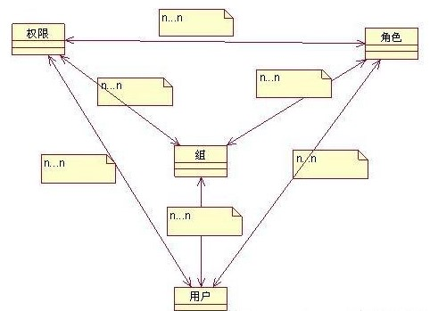
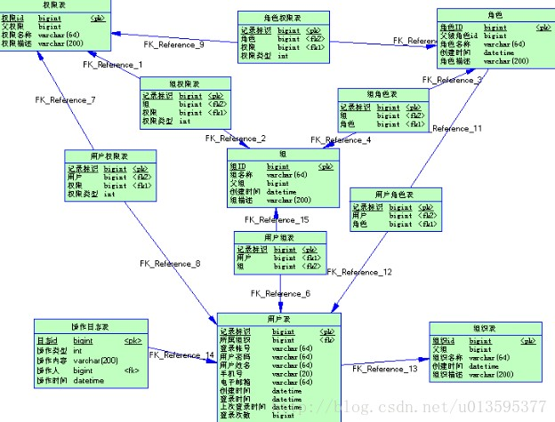

# 目录
- [目录](#%E7%9B%AE%E5%BD%95)
  - [架构](#%E6%9E%B6%E6%9E%84)
  - [子系统实现](#%E5%AD%90%E7%B3%BB%E7%BB%9F%E5%AE%9E%E7%8E%B0)
    - [权限子系统](#%E6%9D%83%E9%99%90%E5%AD%90%E7%B3%BB%E7%BB%9F)
    - [对账子系统](#%E5%AF%B9%E8%B4%A6%E5%AD%90%E7%B3%BB%E7%BB%9F)
  - [问题类型](#%E9%97%AE%E9%A2%98%E7%B1%BB%E5%9E%8B)
    - [一致性问题](#%E4%B8%80%E8%87%B4%E6%80%A7%E9%97%AE%E9%A2%98)
  - [系统类型](#%E7%B3%BB%E7%BB%9F%E7%B1%BB%E5%9E%8B)
    - [计算密集型](#%E8%AE%A1%E7%AE%97%E5%AF%86%E9%9B%86%E5%9E%8B)
    - [缓存](#%E7%BC%93%E5%AD%98)
    - [I/O密集型](#io%E5%AF%86%E9%9B%86%E5%9E%8B)

===========================================

## 架构

===========================================

## 子系统实现

### 权限子系统

//
> ----------RBAC用户、角色、权限、组设计方案 - ljw499356212的博客 - CSDN博客
> https://blog.csdn.net/ljw499356212/article/details/81055141

### 对账子系统

//
> ----------美团配送资金安全治理之对账体系建设 - 美团技术团队
> https://tech.meituan.com/2018/03/21/balance-accounts.html
可以看出，这些都是一些上下游交互的边界场景，以及遇到的问题。当然不仅限于这些场景，凡是有系统交互、数据交互边界的场景，都会出现此类问题，我们称之为“一致性问题”。经粗略统计，我们清结算系统建立以来有70%左右的问题都属于一致性问题。

导致一致性问题的原因有很多，诸如：

幂等、并发控制不当。
基础环境故障：比如网络、数据库、消息中间将发生故障。
其他代码bug。

--
为了系统更加专业化的实现对账、做好对账，我们对支付、清结算等资金领域进行了体系化的调研和学习，并结合业务的自身的特点，总结了一套对账系统构建的思路方法，并基于该思路进行了较完整的系统化实现。

--
1. **问题梳理**

由于数据核对的**目标是发现问题**，那么我们进行数据核对就要从问题出发，首先明确我们要通过对账发现哪些问题，只有这样才能保证数据核对的覆盖度。经过梳理，我们发现在数据流转中过程中数据的不一致问题可以统一归结为三类，分别是漏结、重复结、错结。我们可以从这三个角度去统一进行问题梳理。下面介绍一下这三种错误类型的具体含义。

漏结：发起方有数据，而接收方没有数据。举个例子，目前清结算系统会在订单送达时给骑手结算。如果订单的状态是送达，而没有给骑手生成对应的结算数据。就是一种典型的漏结算场景。
重复结：接收方重复处理。还是上面的例子，如果订单送达，给骑手结算了两次，产生了重复的结算数据，就是重复结算。
错结：发起方和接受方数据不一致。一般会发生在金额和状态两个字段。比如说订单上的数据是用户加小费3元。结算这边只产生了2元的小费结算数据，就是错结。

--
经过总结我们发现，对账的形式无非就是两方比对和自身异常检测两种。两方比对又可以细分为一对一、多对一、一对多。比对方法也主要是分为条目匹配和金额匹配。自身异常检测主要是重复性和异常状态的检测。我们把这些通用的对账逻辑模板化，减少重复的开发工作。

===========================================

## 问题类型

### 一致性问题
//
> ----------美团配送资金安全治理之对账体系建设 - 美团技术团队
> https://tech.meituan.com/2018/03/21/balance-accounts.html
可以看出，这些都是一些上下游交互的边界场景，以及遇到的问题。当然不仅限于这些场景，凡是有系统交互、数据交互边界的场景，都会出现此类问题，我们称之为“一致性问题”。经粗略统计，我们清结算系统建立以来有70%左右的问题都属于一致性问题。

导致一致性问题的原因有很多，诸如：

幂等、并发控制不当。
基础环境故障：比如网络、数据库、消息中间将发生故障。
其他代码bug。

===========================================

## 系统类型

### 计算密集型

//
> ----------重计算型应用的性能优化实践 | 宁静·致远
> http://fengfu.io/2018/06/27/%E9%87%8D%E8%AE%A1%E7%AE%97%E5%9E%8B%E5%BA%94%E7%94%A8%E7%9A%84%E6%80%A7%E8%83%BD%E4%BC%98%E5%8C%96%E5%AE%9E%E8%B7%B5/
系统介绍
ATPCO系统是Qunar国际机票的运价系统，它通过美国ATPCO公司接收全球近500家航空公司的运价、规则数据进行计算，为上层的机票搜索系统提供运价搜索服务。系统的基础数据主要分为运价、规则、航路等数据，其中运价数据有9000万条，规则数据有1.2亿条，平均每条运价关联20条规则数据。规则数据分为Record 0/1/2/3/6/8六大类，其中Record3数据又包含Category1~Category50几十种子规则，以及Table 900系列的若干表、Category 10下面的各种子表。所以业务规则复杂，数据量大是这个系统的一大特点。

### 缓存

//
> ----------高并发场景下缓存的常见问题
> https://www.toutiao.com/i6633536075719508487/?iid=59835956289&app=news_article&group_id=6633536075719508487&timestamp=1549073934

//
> ----------爱奇艺的Java缓存之路，你应该知道的缓存进化史！
> https://www.toutiao.com/i6633537772713935373/?iid=59835956289&app=news_article&group_id=6633537772713935373&timestamp=1549073525

### I/O密集型

-- End --