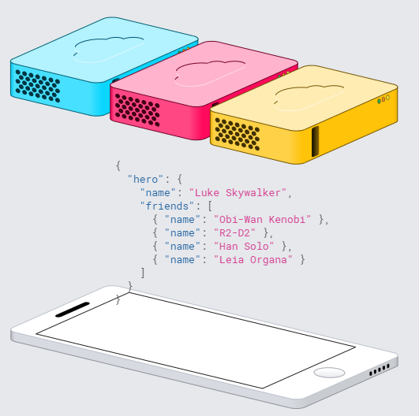

### 2019-1-21阅读日志
------

> ----------GraphQL | 一种为你的 API 而生的查询语言
> http://graphql.cn/

获取多个资源
只用一个请求
GraphQL 查询不仅能够获得资源的属性，还能沿着资源间引用进一步查询。典型的 REST API 请求多个资源时得载入多个 URL，而 GraphQL 可以通过一次请求就获取你应用所需的所有数据。这样一来，即使是比较慢的移动网络连接下，使用 GraphQL 的应用也能表现得足够迅速。

==========

> 豆瓣阅读：佳倩（冰岛生活）/（脊椎s弯曲）上海生活/freelance（上海闵行）

> ----------我身边优秀的**斜杠青年**，都有一个共同特征
> https://baijiahao.baidu.com/s?id=1612992957804963478&wfr=spider&for=pc

巴菲特曾经说过：**人生就是不断抵押的过程**，为前途我们抵押青春，为幸福我们抵押生命。

老爷子这句话的前提是：你得有东西可抵押。否则，你能抵押的就只有时间、青春、生命了。

但这里有个大坑就是：过早地消耗精力在换钱上面，只能换回小钱，而不是换势能、名声、专业。

而你的时间想换大钱，几乎无一例外，都要用你在一个领域内的品牌背书去换。

在毕业后的前五年搞什么斜杠，简直就是拿自己的前途去抵押换钱。人的精力是有限的，做好了副业做不好主业，两三个身份一起做，只会消磨了你在所有领域的口碑。

//

什么叫做定位？

“现代营销教父”的菲利普·科特勒解释：**定位就是你最有价值的地方**。

说白了，就是你的最强项。

就像我们一聊天就会想起微信，一买东西就会打开淘宝，一订餐就打开饿了么，我们基本上不会通过第二个app来实现大而全的功能。

其实做人也是一样。

在自己强大到面面俱到之前，必须有一样拿得出手的、经过10000个小时精锤百炼的技能。那项技能，别人已经可以尊称你为“专业”。

如果你连一项专业都做不到，没有人能相信，你好几项也能做到专业。这不符合常理。

单杠能力要强，强到别人无可替代，那是开启斜杠的一个基本前提。

==========

> ----------斜杠青年，玩有所成的开挂人生！
> https://baijiahao.baidu.com/s?id=1611416934057004763&wfr=spider&for=pc

这世界很大，斜杠很多。

//
每次刷开朋友圈，除了日常分享，现在的朋友圈反而更像是一个推销平台，就看着那十八般武艺，各显着神通。

没有代购的的朋友圈哪还算是个朋友圈，除了销售化妆品、日常用品，更有新娘跟妆、私人订制摄影、幼儿特产教学等等这种卖艺类的，实在没有渠道出国代购或者一技之长的，也会批发点儿特产之类的偶尔卖卖。

//
作为一个曾经的斜杠青年，现在的斜杠中年，我只想对那些跃跃欲试的青年们说一句，**先把主业干出色，才能拥有真正的斜杠人生**。

//
当全力以赴时，才会有更出色的成就。就像阳光是如此温暖，可也只有透过凹凸的镜片的聚焦才能点燃柴火。没有谁对谁错，只是时间对于每个人都是公平的，努力的方向不同，结果也不同。

//
他每天晚上八点开始练字，练到深夜十二点。

有时他像吸毒一样写上瘾，时间走到了凌晨一两点。我亲眼看着他的字一天天变好，每天早上起来都要看到他晒字的图片，发布时间无一例外都在凌晨。

这样的生活他坚持了两年，换来一个书法家的斜杠。

//
因为工作关系接触到一个美国人，他平时在IT公司上班，下班后在**fiverr上（国外的一个兼职网站）**接点跟IT有关的兼职做，有时候搜索一些符合雇主要求的数据，有时候做一些简单的产品调研。

虽然IT行业经常要熬夜，但他仍然在下了班后在家打开电脑，敲着键盘把一个个数据爬出来，整理成Excel，赶在deadline前将表格完成发给雇主们。

他说他有一个女儿，他想带她**走遍世界**，感受世界各地不一样的文化。他很自豪地说，他在短短的两年兼职生活里已经带女儿去过中国的苏州，马来西亚的吉隆坡。虽然离他走遍世界的理想还有点距离，但是我相信他总有一天会实现。

//
Lily把Slash这个词在我心中定义完整，斜杠青年并不仅仅诠释着多职业化身份，做了很多工作，身份多么有趣，而是**所拥有的每一个身份他都是专业的、深刻的、稳定的。这才是一名slash该有的基本特质，这样的slash才会真正的有趣**。lily就是这样一个人。

这个世界就是这样，有趣的东西往往并不简单，如果觉得简单，那一定是理解错误。

那些博而不专，做了不坚持，遇到瓶颈想放弃的人不是SLASH。

他们只是曾经有趣过。
==========

> ----------测评：对于写作的人来说，Markdown是你最好的朋友
> https://baijiahao.baidu.com/s?id=1611928732267286939&wfr=spider&for=pc

在Windows上，到目前为止我最喜欢的Markdown编辑器是Typora，它仍处于测试阶段，但足够稳定，可以每天使用。

==========

> ----------如何点亮你的人生技能树：《斜杠青年》读书笔记 - 少数派
> https://sspai.com/post/47122

然后作者提到了训练自己意志力而写晨间日记的实践，之前看过成甲的《好好学习》也有提到过，对晨间日记有感兴趣的推荐去看看《晨间日记的奇迹》 。

每年年初我都会给自己制定一份计划清单，又要学英语、又要看书、又要健身的，想要的东西太多，但是往往都是因为意志力有限，很难坚持。自从了解意志力的存在并且实践了之后，让我养成一个习惯变得更加容易了。

读过一本日本人写的**《快速阅读术》**，作者的「像听音乐那样读书，没有人会一个音符不漏的听歌。」这个观点给我很深的印象，通过不断的实践和刻意练习，相比以前我现在读书确实快了不少。

文中推荐的书单：
《好好学习》
《晨间日记的奇迹》
《快速阅读术》

==========

> ----------斜杠青年（拥有多重职业和身份的多元生活的人群）_百度百科
> https://baike.baidu.com/item/%E6%96%9C%E6%9D%A0%E9%9D%92%E5%B9%B4/19447422?fr=aladdin

斜杠青年来源于英文Slash，出自《纽约时报》专栏作家麦瑞克·阿尔伯撰写的书籍《双重职业》，指的是一群不再满足“专一职业”的生活方式，而选择拥有多重职业和身份的多元生活的人群。

只有自己对这一领域的足够兴趣，才能坚持到收获的那一天。

==========

> ----------SDK管理利器——sdkman - 简书
> https://www.jianshu.com/p/71cad86537e6

项目使用java的开发者一定会为新配环境变量而头大，sdkman很好的解决了系统sdk管理的痛点，仅需简单的几行命令就可以完成sdk的安装，更改默认版本。
再也不用担心环境变量的问题。

==========

> ----------kdabir/awesome-groovy: A curated list of awesome groovy libraries, frameworks and resources
> https://github.com/kdabir/awesome-groovy#testing

Dru - Data Reconstruction Utility loads data from external sources JSON, YML for easy testing GORM, DynamoDB or just plain POJOs.

==========

-- End --
